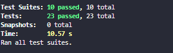
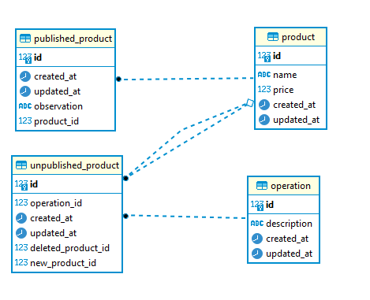

## How to run this project

### Run docker compose
docker compose up -d --build

### Get application's container id 
docker ps

### Go inside container
docker exec -it container_id sh

### Reset database 
npx prisma migrate reset

### Run seeders
npm run seed:operations

### Run tests
npm run test

### Tests results

### Diagram

